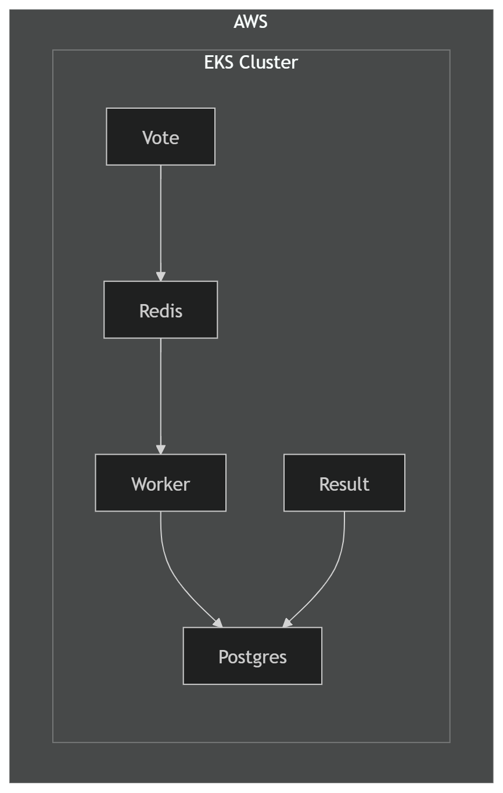
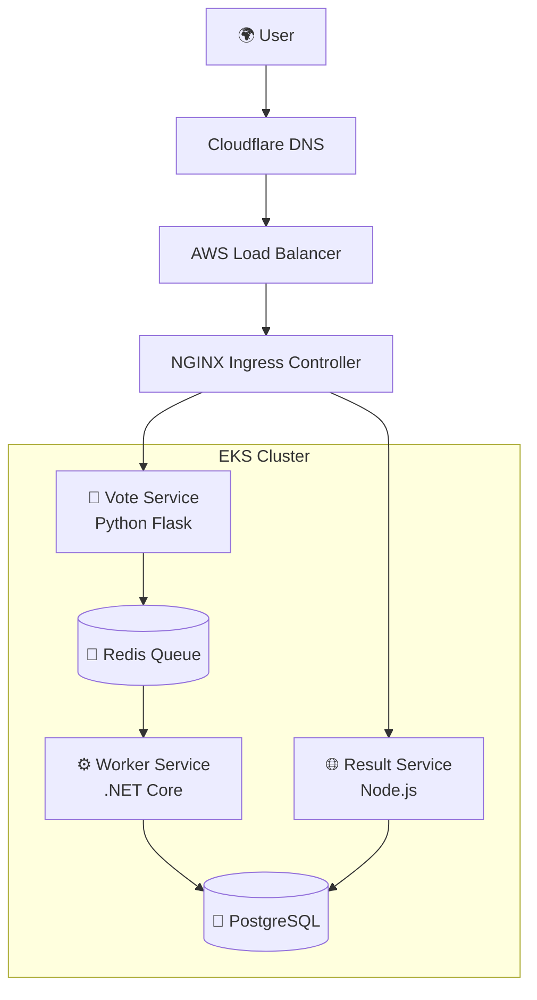

🗳️ Cloud-Native Voting Application
Kubernetes + CI/CD on AWS EKS

A cloud-native microservices application deployed on AWS EKS using Docker, Kubernetes, NGINX Ingress, and GitHub Actions CI/CD.

This project demonstrates the transition from manual Kubernetes deployments to a fully automated DevOps workflow.

🏗️ Architecture Diagram

### 🌐 Traffic Flow

## ⚙️ Microservices

| Service | Technology | Purpose |
|--------|------------|---------|
| 🐍 Vote | Python Flask | Collects votes |
| 🌐 Result | Node.js | Displays results |
| ⚙️ Worker | .NET Core | Processes queued votes |
| 🧠 Redis | In-memory queue | Message broker |
| 🐘 PostgreSQL | Database | Stores results |

🧩 Tech Stack
Cloud Infrastructure

AWS EKS

AWS Elastic Load Balancer

Cloudflare DNS

Containerization

Docker

Docker Hub

Orchestration

Kubernetes

NGINX Ingress Controller

CI/CD

GitHub Actions

Security

Kubernetes Secrets

ConfigMaps

🔄 CI/CD Pipeline
Pipeline Flow
Developer Push
      ↓
GitHub Actions Triggered
      ↓
Build Docker Images
      ↓
Push Images to Docker Hub
      ↓
Deploy to AWS EKS
      ↓
Rolling Update
🎥 Live Application Demo

Place the demo recording here:

docs/demo.gif

Display it like this:

Your demo should show:

Submitting a vote

Redis queue processing

Worker storing vote in PostgreSQL

Result service updating the result page

🚀 Deployment Methods
1️⃣ Manual Kubernetes Deployment

Initial deployments were done manually.

Build Docker Image
        ↓
Push to Docker Hub
        ↓
kubectl apply -f k8s/
        ↓
Application Live

Resources used

Kubernetes Deployments

Services

ConfigMaps

Secrets

Ingress Controller

2️⃣ Automated CI/CD Deployment

The project was enhanced with GitHub Actions automation.

Code Push → GitHub Actions → Build → Push Images → Deploy to EKS
Benefits

🚀 Zero manual deployments

🔐 Secure secret handling

⚡ Faster production updates

📉 Reduced configuration drift

♻️ Immutable container deployments

🌐 DNS & Routing

DNS is managed through Cloudflare.

Example Routing
Domain	Service
vote.domain.com	Vote service
result.domain.com	Result service
Traffic Flow
User → Cloudflare → AWS ELB → NGINX Ingress → Kubernetes Pods
🔐 Secret Management

Sensitive values are never committed to GitHub.

Secrets are injected using:

GitHub Secrets

Kubernetes Secrets

Runtime environment variables

Examples

Database credentials

Redis connection strings

API configuration

📁 Project Structure
.
├── k8s
│   ├── namespace.yaml
│   ├── postgres.yaml
│   ├── redis.yaml
│   ├── vote.yaml
│   ├── result.yaml
│   ├── worker.yaml
│   └── ingress.yaml
│
├── vote
├── result
├── worker
│
├── docs
│   ├── architecture.png
│   ├── pipeline.png
│   └── demo.gif
│
└── .github
    └── workflows
        └── cicd.yml
⚠️ Challenges Faced

This project required debugging across networking, DNS, and Kubernetes layers.

Key Issues Solved

Cloudflare proxy vs DNS conflicts

Ingress host routing mismatches

Worker service connection errors

Secure secret injection

Debugging Tools Used
kubectl logs
kubectl describe
kubectl get ingress
kubectl get svc
curl -H "Host:..."
📚 Engineering Lessons Learned

Kubernetes routing is host-header driven

Ingress 404 errors often indicate routing misconfiguration

CI/CD reduces operational deployment friction

Secrets should never be committed to Git

Observability is critical for distributed systems

🔮 Future Improvements

cert-manager for automatic TLS

Prometheus + Grafana monitoring

Helm packaging

Blue/Green deployments

Automated integration testing

👨‍💻 Author

Prince Onuoha

DevOps Engineer focused on cloud-native infrastructure, Kubernetes orchestration, and automated deployment pipelines.
